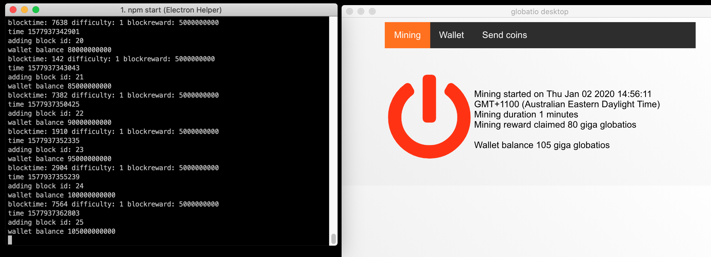

# exprimental code

### Get the code

```
$ git clone https://github.com/globatio/globatiotools.git
$ cd globatiotools
$ npm install
```

### to run on testnet

```
$ npm test
```

### Sample image of globatio desktop


